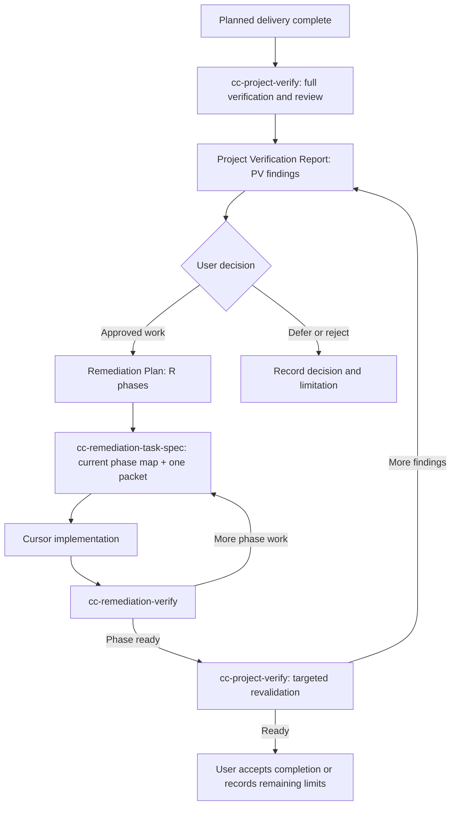

# Project Verification And Remediation Contract

Project verification is a closing workflow performed after planned implementation work is complete. It is distinct from milestone bookkeeping and from task-level verification: it establishes whether the implemented project is coherent across product behavior, approved design, architecture, integration boundaries, and recorded delivery limitations.

## Responsibility Boundary

| Activity | Owner |
| --- | --- |
| Full or targeted project verification, independent review, finding triage, verification report, remediation plan, and final revalidation | Codex via `cc-project-verify` |
| Map the current remediation phase and prepare or revise one bounded remediation packet | Codex via `cc-remediation-task-spec` |
| Implement one approved remediation packet and run only its permitted self-checks | Cursor |
| Verify one remediation packet, record its evidence, and route the next action | Codex via `cc-remediation-verify` |
| Approve remediation scope, material changes, deferrals, and final project acceptance | User |

The existing `cc-task-spec` and `cc-task-verify` workflow remains reserved for work originating in the implementation plan. Do not add remediation tasks to implementation-plan milestones, revise accepted implementation Task Specs, or use remediation findings to rewrite historical delivery records.

## Lifecycle

## Artifact Locations

- `docs/project/project-verification-report.md` is the durable evidence and finding record.
- `docs/project/remediation-plan.md` is the approved remediation roadmap and phase register.
- `docs/remediation/R-<phase>-<slug>/R-<phase>-TASK-<number>-<slug>.md` is one Cursor remediation contract.

The report owns `PV-001`-style finding IDs. The remediation plan owns `R-001`-style phase IDs. A remediation task references one or more existing findings; it does not create a new finding ID merely to name a coding task.

## User Decision Gate

After initial verification, Codex stops with the report status `awaiting-user-decision`. The user may approve, defer, reject, or request a change to each proposed remediation item.

A finding that requires a product, design, architecture, security, cost, account, deployment, or launch-scope decision remains blocked until the owning artifact is updated and the user approves the decision. Subjective user feedback is recorded separately from evidence-backed discrepancies and enters the remediation plan only after the user approves its scope.

## Completion

An accepted remediation task means only that its bounded correction has evidence. A `PV-*` finding becomes `closed` only after `cc-project-verify` performs the required targeted revalidation. The project becomes `completed` only after all accepted remediation work is revalidated and the user accepts the final report, or explicitly accepts documented deferrals and limitations.
