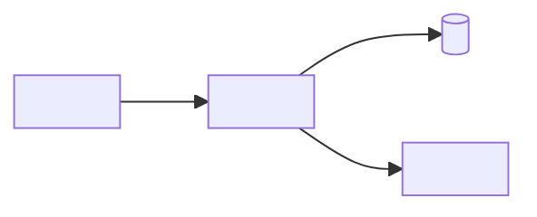

# Technical Architecture Contract

`cc-architect` owns `docs/project/technical-architecture.md`. The artifact describes the technical shape of the project in enough detail for implementation planning and later Cursor task specifications.

It is not a product specification, design document, exhaustive schema migration, deployment runbook, or low-level task list.

## Frontmatter

Use this minimal frontmatter. Dates use `YYYY-MM-DD`.

```yaml
---
artifact: technical-architecture
version: 1
status: draft
stage: architecture
created: YYYY-MM-DD
updated: YYYY-MM-DD
sources: []
related:
  - docs/project/brief.md
  - docs/project/product-spec.md
  - docs/project/functional-spec.md
  - docs/project/design-brief.md
  - docs/project/screen-spec.md
  - docs/project/design-system.md
  - docs/project/asset-manifest.md
stack:
  application: []
  data: []
  infrastructure: []
  testing: []
tags: []
---
```

Allowed `status` values:

* `draft` - architecture is in progress or non-blocking questions remain;
* `ready-for-implementation-planning` - technical direction is settled enough to plan implementation phases;
* `blocked` - architecture cannot proceed until a missing decision, source, tool, account, or constraint is resolved;
* `superseded` - another architecture artifact has replaced this one.

`sources` lists project artifacts, source repositories, user-provided links, service docs, examples, decisions, or other authoritative inputs that materially informed the architecture. `related` should include upstream product and design artifacts. `stack` summarizes the selected stack or constrained options for quick routing by later agents.

## Required Body

```md
# Technical Architecture: <Project Name>

## Architecture Summary

<A concise description of the selected technical direction and why it fits the product and design requirements.>

## Source Repository Findings

- <Repository or other source, what was inspected, and which architectural patterns or constraints should be reused or avoided.>

## Technical Requirements Derived From Product And Design

- <Requirement, source artifact or acceptance criterion, and architecture implication.>

## Stack Decision

### Selected Stack

- <Layer or concern>: <technology, service, framework, or constrained option>.

### Rationale

- <Reason tied to product behavior, design constraints, team capability, cost, deployment, risk, or maintainability.>

### Alternatives Considered

- <Alternative, why it was rejected or deferred.>

## Application Structure

<Major modules, boundaries, ownership areas, client/server split, routing direction, background jobs, realtime/offline behavior, and how the structure supports future Cursor tasks.>

Use Mermaid diagrams when architecture relationships are easier to verify visually than in prose. Good candidates include system component boundaries, data ownership, integration flow, event flow, deployment shape, trust boundaries, and module dependencies. Keep diagrams at architecture level and tie labels to stable names or ADR IDs where useful.

Optional Component Diagram:



## Data Architecture

<Core entities, ownership, relationships, persistence direction, migrations, import/export, retention, backup, privacy, and data integrity expectations at architecture level.>

## API, Contracts, And Integration Boundaries

<Internal APIs, external APIs, webhooks, files, queues, events, third-party services, rate limits, failure handling, and provider assumptions.>

## Authentication, Authorization, And Security

<Identity model, roles, permissions, sessions, secrets, sensitive data, threat assumptions, auditability, and security boundaries.>

## UX And Design-System Implementation Constraints

<Technical implications of approved screen structure, responsiveness, accessibility, component needs, media/assets, performance, motion, and design-system expectations.>

## Validation, Testing, And Quality Strategy

<A concise strategy explaining which kinds of proof the project needs and why those layers fit the selected stack, product risks, and acceptance criteria.>

| Test Layer Or Check | Owner | Scope | Evidence It Must Produce | Runs When | Related AC/Risk |
| --- | --- | --- | --- | --- | --- |
| <Unit, integration, e2e, accessibility, contract, migration, security, performance, visual, smoke, manual QA, or custom check> | <Cursor self-check, Codex verification, user review, or `Not applicable`> | <What it covers and what it intentionally does not cover> | <Pass/fail signal, report, screenshot, log, command output, fixture result, or reviewed artifact> | <Local dev, task verification, CI, before deploy, after deploy, release gate, or manual review> | <AC-001, ADR-001, risk ID, or `Not applicable`> |

Required Test Data And Fixtures:

- <Seed data, accounts, mocked services, generated files, snapshots, API fixtures, migration fixtures, or privacy-safe sample data needed for reliable tests.>

Manual Or Exploratory Checks:

- <Human review, device/browser check, visual inspection, accessibility pass, operational dry run, or user acceptance check that cannot be fully automated yet.>

For UI work, name the approved visual reference, required viewport/state coverage, and owner of the comparison. A DOM, selector, or no-overflow assertion does not replace visual fidelity review.

Deferred Test Coverage:

- <Coverage intentionally delayed, why it is acceptable, and which implementation milestone or risk should revisit it.>

## Deployment, Environments, And Operations

<Hosting, environments, build and release approach, configuration, secrets, migrations, monitoring, logging, analytics, backups, and operational ownership.>

## Developer Tooling And Setup

| Capability | Type | Required / recommended | Why it is needed | Availability / setup owner | Used by | Needed by |
| --- | --- | --- | --- | --- | --- | --- |
| <Name> | <Skill, plugin, CLI, SDK, account, credential, environment, script> | <Required / recommended> | <Architecture-specific rationale> | <Available / missing; user, Codex, or environment owner> | <Cursor, Codex, or both> | <Milestone or task> |

List intentionally unneeded plausible tools below the matrix when their omission protects scope or avoids an unsupported assumption.

## Architecture Decisions

| ID | Decision | Status | Rationale | Owner |
| --- | --- | --- | --- | --- |
| ADR-001 | <Decision> | proposed | <Why this is the recommended choice.> | <Codex/user/team> |

## Risks And Tradeoffs

- <Risk, likelihood or impact when known, mitigation, and owner.>

## Assumptions To Validate

- <Unconfirmed technical assumption, why it matters, and how it can be validated.>

## Open Technical Decisions

- <Decision, why it affects architecture or implementation planning, and owner when known.>

## Handoff To Implementation Plan

<Implementation sequencing constraints, prerequisites, validation gates, and areas that should become project-level implementation stages.>
```

Omit sections only when genuinely irrelevant. Keep explicit `Not applicable` notes when a later stage could otherwise mistake omission for oversight.

## Writing Rules

* Tie technical choices to product behavior, acceptance criteria, approved design constraints, source repository evidence, and user constraints.
* Distinguish confirmed decisions from recommendations, assumptions, and open questions.
* Use Mermaid diagrams when they clarify component, data, integration, event, deployment, module-dependency, or trust-boundary relationships that prose would make hard to scan.
* Keep diagrams synchronized with the surrounding text. Diagrams support architecture decisions; they do not replace written rationale, risks, or handoff constraints.
* Keep architecture at planning level: name major modules and data direction, but do not write complete schemas, endpoint specs, or low-level task lists unless the architecture decision requires that precision.
* Include testing and deployment strategy here because implementation planning needs to sequence validation and environment work.
* Plan test layers up front. Name what each layer proves, when it should run, what evidence it should produce, and which acceptance criteria, architecture decisions, or risks it covers.
* Do not use tool popularity as a reason. Explain fit, tradeoffs, implementation cost, and risk.
* Do not choose external services, auth providers, hosting, paid tools, or data providers silently when the choice affects cost, ownership, privacy, or account setup.

## Readiness Check

Set `status: ready-for-implementation-planning` only when all of these are true:

- [ ] Stack direction is selected or bounded with clear rationale.
- [ ] Application structure and major boundaries are understandable.
- [ ] Non-trivial component, data, integration, event, deployment, or trust-boundary relationships are described in prose and, when useful, shown with compact Mermaid diagrams.
- [ ] Data architecture covers core entities, persistence, integrity, and retention concerns that matter.
- [ ] Required integrations and external service boundaries are visible.
- [ ] Auth, permissions, security, and privacy are covered or explicitly not applicable.
- [ ] Design-system and screen constraints that affect implementation are accounted for.
- [ ] Testing, validation, deployment, environment, and operations strategy are clear enough to plan work.
- [ ] Test layers identify scope, expected evidence, timing, required fixtures or test data, and related acceptance criteria or risks.
- [ ] Each test layer has an explicit owner; E2E, acceptance, runtime, visual, accessibility, integration, and release proof are not implicitly delegated to Cursor.
- [ ] Required test-runtime and visual-review prerequisites have a setup owner and earliest-needed milestone.
- [ ] Stack-specific implementation guidance has been assessed and any useful missing capability has been recommended to the user.
- [ ] Required and recommended tools, skills, plugins, CLIs, SDKs, accounts, credentials, environments, and source repositories are listed in an implementation-capability matrix with rationale, availability, owner, and earliest needed milestone.
- [ ] Risks, assumptions, and open decisions are visible.
- [ ] No unresolved decision would materially change stack, data, auth, integration, deployment, or validation strategy.
