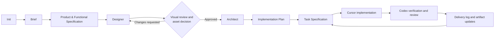
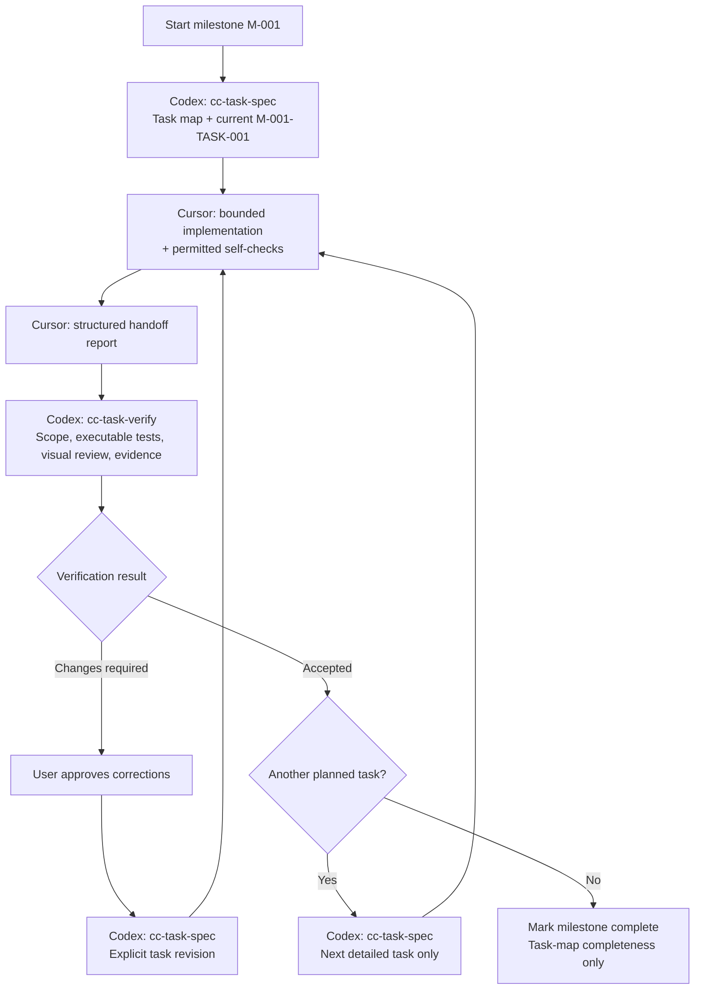

# Stage Resources

This document is a working inventory of tools, skills, prompts, checklists, scripts, hooks, subagents, and supporting materials used across the project-creation workflow.

It is intentionally provisional. Its purpose is to help design the system while the workflow is still evolving. It may later be simplified, split into agent-specific skill files, or removed.

Current scope: greenfield project creation through the Task Specification and Delivery Loop.

This file is a design-time inventory for this workflow-system repository. It is not a production stage input and does not need to be copied into target projects. Target projects should rely on `.agents/`, `.codex/`, `.cursor/`, and generated `docs/project/` artifacts unless a future packaging step intentionally includes additional reference docs.

## Workflow At A Glance

Each completed stage is a Git checkpoint. Designer begins by selecting reference research, full visual design, or a deliberate documentation-only opt-out.

## How To Use This File

For each workflow stage, track:

* intended owner;
* primary skill or prompt;
* supporting skills, tools, subagents, scripts, hooks, or checklists;
* input artifacts;
* output artifacts;
* frontmatter or metadata needs;
* open decisions.

Use this file to decide where a material belongs:

* `.agents/` for shared materials used by more than one agent;
* `.codex/` for Codex-specific stage skills, analysis prompts, subagents, review prompts, and orchestration;
* `.cursor/` for Cursor-specific implementation rules, coding prompts, and editor-native rules;
* `docs/` for human-readable workflow design documents in this repository, and generated project artifacts or records inside target projects.

## Stage Resource Map

### Init

Purpose:

Initialize a new project workspace for the workflow system.

Intended owner:

Codex, with user approval for repository or remote actions.

Primary skill or prompt:

`.codex/skills/cc-init/SKILL.md`.

Supporting resources:

* minimal `AGENTS.md` entrypoint contract defined in `cc-init`;
* `.agents/artifacts/project-status.md` - shared project-status contract;
* `.agents/artifacts/stage-closure.md` - commit and closure contract for every stage;
* `.agents/skills/make-interfaces-feel-better/` - full baseline shared UI-polish skill that target projects may receive during workflow bootstrap;
* `.agents/scripts/validate-project-artifacts.py` - lightweight local validator for project artifact frontmatter, statuses, related links, and stable IDs;
* Do ustalenia: project folder bootstrap script;
* Do ustalenia: git initialization script for later automation;
* Do ustalenia: GitHub repository creation script or checklist;
* Do ustalenia: safety checklist for destructive or remote actions.

Input artifacts:

* project name or working title;
* target project directory;
* user's preference for local-only, git, or remote repository setup.

Output artifacts:

* initialized project workspace;
* minimal project entry point or context index;
* git repository with `main` as the primary branch;
* `docs/project/status.md` with Brief as the next stage.

Frontmatter or metadata needs:

* likely none for `AGENTS.md`;
* required for `docs/project/status.md`: `artifact`, `version`, `project_status`, `current_stage`, `created`, `updated`, `related`;
* bootstrap logs or init reports may need metadata later.

Open decisions:

* Init creates the smallest `AGENTS.md`; Brief adds only the compact project snapshot;
* decide which folders are created immediately and which are created on demand;
* decide whether shared baseline skills such as `make-interfaces-feel-better` are copied during `cc-init` itself or by a separate bootstrap step that Init invokes;
* decide whether GitHub setup is part of the default path or an explicit option.

### Brief

Purpose:

Collect and pressure-test the project idea.

Intended owner:

Codex, with user input.

Primary skill or prompt:

`.codex/skills/cc-brief/SKILL.md`.

Supporting resources:

* `cc-brief/references/project-brief.md` - artifact contract and readiness check;
* `.codex/skills/cc-grill/SKILL.md` - pressure-test support for Standard and Deep discovery;
* `.agents/artifacts/project-status.md` - shared project-status contract;
* later, if justified: focused use of `requirements-critic` for brief-level requirement risks;
* later, if justified and authorized: inspiration or market research support.

Input artifacts:

* user idea;
* rough notes;
* references or inspiration links, when provided.

Output artifacts:

* `docs/project/brief.md`;
* updated `docs/project/status.md`;
* project direction, goals, and non-goals;
* initial capability hypotheses;
* assumptions and open questions.

Frontmatter or metadata needs:

* required for `docs/project/brief.md`: `artifact`, `version`, `status`, `stage`, `created`, `updated`, `sources`, `related`.

Open decisions:

* whether the brief needs a separate change log or revision history once projects become long-lived;
* whether Brief should ever use `requirements-critic`, or whether requirements criticism should remain owned by `cc-spec`.

### Product / Functional Specification

Purpose:

Define the product shape and product behavior before design and technical architecture.

Intended owner:

Codex, with user approval.

Primary skill or prompt:

`.codex/skills/cc-spec/SKILL.md`.

Supporting resources:

* `cc-spec/references/product-spec.md` - product specification contract and readiness check;
* `cc-spec/references/functional-spec.md` - functional specification contract, acceptance criteria style, and readiness check;
* `cc-spec/references/requirements-review.md` - complexity assessment, critic depth, and findings handling contract;
* Mermaid diagrams in `docs/project/functional-spec.md` when user flows, state transitions, or functional dependencies are easier to understand visually;
* `.codex/agents/requirements-critic.md` - read-only independent requirements review subagent used by `cc-spec`, defaulting to `gpt-5.6-luna` with `medium` reasoning effort;
* `.agents/artifacts/project-status.md` - shared project-status contract;
* source repositories, user-provided notes, or direct references when relevant and available;
* `.agents/scripts/validate-project-artifacts.py` - deterministic check for required frontmatter, allowed statuses, related links, and stable IDs.

Input artifacts:

* project brief;
* user decisions;
* reference materials, when relevant.

Output artifacts:

* `docs/project/product-spec.md`;
* `docs/project/functional-spec.md`;
* resolved and unresolved product decisions;
* feature groups, user flows, optional Mermaid flow/state diagrams, product-level acceptance criteria, and unresolved functional questions inside the functional specification.

Frontmatter or metadata needs:

* required for `docs/project/product-spec.md`: `artifact`, `version`, `status`, `stage`, `created`, `updated`, `sources`, `related`;
* required for `docs/project/functional-spec.md`: `artifact`, `version`, `status`, `stage`, `created`, `updated`, `sources`, `related`.

Open decisions:

* default to two artifacts: product specification and functional specification;
* decide later whether large projects need additional feature-area specs;
* decide how detailed screen/user-flow descriptions should be before Designer;
* decide whether requirements review findings should later be saved as a separate artifact for high-risk projects or remain inside the stage handoff.

### Designer

Purpose:

Define the product's UX and visual direction.

Intended owner:

Codex, using design tools and user feedback.

Primary skill or prompt:

`.codex/skills/cc-designer/SKILL.md`.

Supporting resources:

* `cc-designer/references/tool-readiness.md` - tool setup, MagicPath workflow, Mobbin routing, and user approval/status handling;
* `cc-designer/references/design-brief.md` - visual direction, UX principles, references, tooling, and handoff constraints;
* `cc-designer/references/screen-spec.md` - screen/view inventory, navigation, states, responsive notes, and flow coverage;
* `cc-designer/references/design-system.md` - token direction, component inventory, interaction patterns, accessibility rules, and UI polish expectations;
* `cc-designer/references/asset-manifest.md` - required assets, provenance, formats, readiness, and delivery decision;
* Mermaid diagrams in `docs/project/screen-spec.md` when screen maps, navigation, or cross-screen flows need a compact text source of truth;
* `.agents/skills/make-interfaces-feel-better/` - full shared UI-polish lens for typography, surfaces, motion, icons, hit areas, and review;
* Mobbin plugin - preferred source for real UI screens, flows, and website section references when available;
* MagicPath or another visual workspace - required for the selected Full visual design mode; requires user login/project setup outside Codex when no direct integration is available;
* generated visual references or image tools, when useful for mood, art direction, bitmap mockups, or asset direction;
* optional tools such as Figma, Adobe, or Canva only when the project and available plugins justify them;
* `.codex/agents/design-researcher.md` - read-only UI/UX reference researcher for Mobbin, user-provided references, screenshots, and comparable patterns;
* `.codex/agents/design-critic.md` - read-only UX/design reviewer subagent for standard and deep design reviews, defaulting to `gpt-5.6-luna` with `medium` reasoning effort.

Input artifacts:

* project brief;
* product specification;
* functional specification;
* user inspiration or brand references;
* technical constraints already known, if any.

Output artifacts:

* `docs/project/design-brief.md`;
* `docs/project/screen-spec.md`;
* `docs/project/design-system.md`;
* `docs/project/asset-manifest.md`;
* optional Mermaid screen, navigation, or interaction-flow diagrams when they reduce ambiguity;
* visual references or generated design artifacts, when used;
* design constraints for architecture and planning.

Frontmatter or metadata needs:

* required for `docs/project/design-brief.md`: `artifact`, `version`, `status`, `stage`, `created`, `updated`, `sources`, `related`;
* required for `docs/project/screen-spec.md`: `artifact`, `version`, `status`, `stage`, `created`, `updated`, `sources`, `related`;
* required for `docs/project/design-system.md`: `artifact`, `version`, `status`, `stage`, `created`, `updated`, `sources`, `related`;
* required for `docs/project/asset-manifest.md`: `artifact`, `version`, `status`, `stage`, `created`, `updated`, `sources`, `related`;
* design artifact statuses include `draft`, `ready-for-user-review`, `approved-for-architecture`, and `superseded`;
* tool-specific outputs may have their own metadata formats, but project artifacts should link them instead of duplicating tool internals.

Open decisions:

* Designer runs before Architect by default unless the user has already fixed technical constraints that must be known first;
* use a hybrid installation model: baseline shared skills during Init/bootstrap, project-specific account-backed plugins at the start of Designer;
* Designer begins by having the user select reference research, Full visual design, or an explicit Documentation-only opt-out;
* Designer only marks the stage complete after explicit user approval of the selected-mode evidence and an asset-delivery decision;

### Architect

Purpose:

Define the technical architecture after product and design direction are known.

Intended owner:

Codex, with user approval for major tradeoffs.

Primary skill or prompt:

`.codex/skills/cc-architect/SKILL.md`.

Supporting resources:

* `cc-architect/references/technical-architecture.md` - artifact contract, required architecture areas, frontmatter, status values, and readiness check;
* `cc-architect/references/technical-readiness.md` - source repository inspection, missing tools, skills, plugins, accounts, credentials, and installation/connection boundaries;
* implementation-capability matrix in `docs/project/technical-architecture.md` - required and recommended skills, plugins, CLIs, SDKs, accounts, credentials, availability, owner, rationale, and earliest needed milestone;
* `cc-architect/references/architecture-review.md` - complexity assessment, review areas, finding groups, and handling rules;
* Mermaid diagrams in `docs/project/technical-architecture.md` when system boundaries, data ownership, integration flow, event flow, deployment shape, or security boundaries need visual clarification;
* source repositories, starter projects, examples, templates, and existing systems when available;
* available stack-specific skills or plugins, selected only when they materially help the project;
* available deployment, repository, design, data, auth, AI, or integration plugins when the selected architecture justifies them;
* `.codex/agents/architecture-critic.md` - read-only independent architecture review subagent used by `cc-architect`, defaulting to `gpt-5.6-luna` with `medium` reasoning effort;
* later, if justified: focused security, performance, or deployment reviewer subagents for larger projects.

Input artifacts:

* project brief;
* product specification;
* functional specification;
* approved design brief;
* approved screen spec;
* approved design system;
* user constraints;
* required integrations or services.

Output artifacts:

* technical architecture specification;
* stack decision or stack constraints;
* data and integration plan;
* optional Mermaid architecture, data, integration, event, or deployment diagrams when they improve implementation readiness;
* authentication, authorization, and security plan when relevant;
* validation and test strategy;
* deployment and operations assumptions;
* required and recommended skills, plugins, accounts, credentials, tools, and source repositories;
* technical risks and assumptions.

Frontmatter or metadata needs:

* required for `docs/project/technical-architecture.md`: `artifact`, `version`, `status`, `stage`, `created`, `updated`, `sources`, `related`, `stack`, `tags`;
* architecture artifact statuses include `draft`, `ready-for-implementation-planning`, `blocked`, and `superseded`.

Open decisions:

* Designer remains the default predecessor because UX, screen, and design-system constraints affect stack and implementation choices; stack may be constrained earlier only when the user, organization, existing repository, or source system already fixed it;
* major architecture decisions that affect cost, account ownership, data sensitivity, security posture, hosting, auth, integration providers, or maintainability require explicit user approval;
* testing and validation strategy belongs in Architecture at strategy level, while exact sequencing and task-level commands belong in Implementation Plan and later Cursor task specs;
* use a hybrid tool model: inspect available source repositories first, then ask whether Codex should install/connect useful missing skills or plugins when tool support exists, or whether the user will install/connect them manually and confirm readiness.

### Implementation Plan

Purpose:

Break the project into ordered implementation milestones.

Intended owner:

Codex, with user approval.

Primary skill or prompt:

`.codex/skills/cc-plan/SKILL.md`.

Supporting resources:

* `cc-plan/references/implementation-plan.md` - artifact contract, milestone format, frontmatter, status values, traceability, and readiness check;
* `cc-plan/references/planning-review.md` - complexity assessment, review areas, finding groups, and handling rules;
* Mermaid diagrams in `docs/project/implementation-plan.md` when milestone dependencies, prerequisites, blockers, or validation gates are easier to scan visually;
* `.codex/agents/planning-critic.md` - read-only independent planning review subagent used by `cc-plan`, defaulting to `gpt-5.6-luna` with `medium` reasoning effort;
* source repositories, starter projects, templates, examples, existing systems, and prior delivery notes when available;
* `.agents/scripts/validate-project-artifacts.py` - deterministic check for required frontmatter, allowed statuses, related links, and stable IDs.

Input artifacts:

* project brief;
* product specification;
* functional specification;
* approved design brief;
* approved screen spec;
* approved design system;
* technical architecture specification.

Output artifacts:

* ordered implementation plan;
* milestones with goal, scope, result, dependencies, traceability, validation notes, and task-specification notes;
* dependency map, optional Mermaid milestone diagram, validation gates, setup prerequisites, launch-readiness notes, risks, assumptions, and open planning decisions;
* first Cursor task-specification candidate;
* enough context to create task-level specifications later without re-reading the whole project history.

Frontmatter or metadata needs:

* required for `docs/project/implementation-plan.md`: `artifact`, `version`, `status`, `stage`, `created`, `updated`, `sources`, `related`, `plan_depth`, `tags`;
* implementation plan artifact statuses include `draft`, `ready-for-task-specification`, `blocked`, and `superseded`;
* milestones use stable `M-001`-style IDs.

Open decisions:

* decide whether large projects need separate release-plan or rollout-plan artifacts, or whether those remain sections in the implementation plan.

### Task Specification And Delivery Loop

Purpose:

Create a lightweight task map for one implementation milestone, prepare only its current Cursor implementation contract, then run Codex-owned verification before the next contract is written.

Process:

The final node does not run a new global test. Every task is verified by `cc-task-verify`; milestone closure only confirms that the planned task map is accepted and has no blocking delivery implication. Cursor completes a task when its own completion boundary is met, even if a later task is still needed to finish a wider feature.

Intended owner:

Codex; Cursor implements only the bounded code change; the user owns material decision approvals.

Primary skill or prompt:

`.codex/skills/cc-task-spec/SKILL.md` followed by `.codex/skills/cc-task-verify/SKILL.md` after Cursor handoff.

Supporting resources:

* `cc-task-spec/references/task-specification.md` - task packet structure, statuses, and readiness check;
* `cc-task-verify/references/task-verification.md` - Codex evidence, correction-request, and outcome rules;
* `.agents/artifacts/task-delivery.md` - cross-agent responsibility boundary;
* `.agents/artifacts/delivery-log.md` - durable implementation-derived correction record;
* `.cursor/rules/implement-task-spec.mdc` - Cursor-only implementation and handoff rules;
* `.agents/scripts/validate-project-artifacts.py` - structural validation for project artifacts and task packets.

Test ownership:

* Architecture selects layers, scenario sources, owners, and test-runtime prerequisites.
* Cursor runs only the self-checks explicitly permitted by the current task.
* Codex creates or updates executable acceptance/regression evidence when needed, runs E2E and other runtime/visual/integration proof, and accepts or blocks the task.

Input artifacts:

* ready implementation plan;
* selected ready milestone and its upstream sources;
* current repository state;
* relevant accepted task records and unresolved delivery-log implications.

Output artifacts:

* a lightweight Task Delivery Register for the selected milestone and one `docs/tasks/M-<milestone>-<slug>/M-<milestone>-TASK-<number>-<slug>.md` Cursor-ready specification;
* Codex-owned task verification history and `docs/project/delivery-log.md` entry;
* corrected plan or source artifacts when delivery materially changes their assumptions.

Frontmatter or metadata needs:

* task packets use `artifact`, `version`, `status`, `stage`, `task_id`, `task_ref`, `revision`, `milestone`, `created`, `updated`, `sources`, `related`, `depends_on`, and `tags`;
* delivery log uses `artifact`, `version`, `status`, `created`, `updated`, and `related`.

Open decisions:

* whether a future high-assurance workflow should split Codex verification and independent code review into separately invocable skills;
* whether release planning and knowledge capture should remain an extension of the delivery log or become their own closing stage.

## Later Workflow Areas

These areas are intentionally not designed in detail yet:

* existing project onboarding and current-state analysis;
* completion and knowledge capture.
